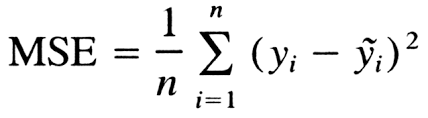

__**DAY 9**__
A. Neural Networks with TensorFlow
Input, Hidden, Output & Bias connected to Hidden and another Bias to Output but not to each other.
Input - The layer to which our initial data is passed to. First layer in the neural network.
Output - The later to retireve our results from.  Last layer of the neural network.
Hidden - Layers that are neither Input nor Output layers. They process the information given by the previous layer (Input) and pass it on to next layer (Output). They are used for processing complex patterns or information. Intermediate layers that helps us learn complex patterns from our input data.
#Bias - A constant added to each neuron’s activation calculation which allows the model to fit best for its training dataset.
A densely connected neural network is one in which all the neurons in the current layer are connected to every neuron in the provious layer.

__**DAY 10**__
B. Activation Functions
They are simple a function that is applied to the weighed sum of a neuron. They can be anything but are typically higher order/degree functions that aim to add a higher dimension to our data. We would want to do this introduce more compexity to our model. By transforming our data to a higher dimension we can typically make better, more complex predictions. 
Types:- 
    1. Relu (Rectified Linear Unit) (makes the negative no.s to zero)
    2. Tanh (Hyperbolic Tangent) (squishes values closer to -1 and +1)
    3. Sigmoid (squishes values between 0 and 1. -Ve to 0 & +ve to 1)

LOSS Function - Calculates how much far away our realtime result is from the expected result.
For eg:- Expected Result = 1 & Realtime result = 0.7. 
#Loss function will return a high value because it's very close to the actual output.

Common loss/cost functions include:
- Mean Squared Error(MSE)

- Mean Absolute Error(MAE)

- Hinge Loss

Gradient Descent - the algorithm used to find the optimal parameters (weights and biases) for our network, while backpropagation is the process of calculating the gradient that is used in the gradient descent step.

Backpropagation, short for "backward propagation of errors," is a fundamental algorithm used in training artificial neural networks. It's a supervised learning algorithm that adjusts the weights of connections in the network to minimize the difference between the predicted output and the actual output for a given set of training examples.
Here's how the backpropagation algorithm works:
1. **Forward Pass**: In the forward pass, input data is propagated through the network layer by layer, from the input layer to the output layer. Each neuron's output is calculated based on its input, weighted connections, and activation function. The output of the network is compared with the actual output (ground truth) to calculate the error.

2. **Backward Pass (Error Backpropagation)**: In the backward pass, the algorithm works backward from the output layer to the input layer. It calculates the gradient of the error function with respect to the weights of the connections by applying the chain rule of calculus. The gradient represents the direction and magnitude of the change required to reduce the error.

3. **Weight Update**: Once the gradients are computed, the algorithm updates the weights of the connections to minimize the error. This update is typically done using an optimization algorithm such as gradient descent or one of its variants. The weights are adjusted in the direction that decreases the error, with the size of the adjustment determined by the learning rate.

4. **Iteration**: Steps 1-3 are repeated iteratively for multiple epochs or until the error converges to a satisfactory level. During each iteration, the network learns to make better predictions by gradually adjusting its weights based on the observed errors.

Backpropagation is crucial for training deep neural networks, enabling them to learn complex patterns and relationships within large datasets. Despite its computational intensity and potential challenges like vanishing gradients in deep networks, backpropagation remains a cornerstone algorithm in modern machine learning and artificial intelligence.

C. Optimizers 
It decides how we will minimize this loss function.
An optimization algorithm used to minimise some function by iteratively moving in the direction of the steepest descent and defined by the negative of the gradient. In machine learning we use gradient descent to update the parameters of our model.
Common ones:-
- Gradient descent
- Stochastic gradient descent
- Mini batch gradient descent 
- Nesterov accelerated gradient

Data Preprocessing - Apply prior transformations to the data before feeding it to the model.

#Building Model
Layer 1: This is our input layer and it will consists of 784 neurons. We use the flatten layer with an input shape of (28, 28) to denote that our input should come in that shape. The flatten means that our layer will reshape the shape (28,28) array into a vector of 784 neurons so that each pixel will be associated with one neuron.
Layer 2: This is our first and only hidden layer. The dense denotes that this layer will be fully connected and each neuron from the previous   connects to each neuron of this layer. It has 128 neurons and uses the rectify linear unit activation function.
Layer 3:  This is the output and the dense layer. It has 10 neurons to determine our models output. Each neuron represents the probability of a given image being one of the 10 different classes. The activation function (softmax) is used to calculate the probability distribution for each class. Value of any neuron in this layer will be between 0 and 1, where 1 is of high probability of the image being that class

D. Creating a Model
#Evaluating the Model
Using built-in method from keras.
The verbose argument is defined from documentation as: "verbose:0 or 1. Verbosity mode. 0=silent, 1=progress bar."
Accuracy is lower on the Testing Data than the Training Data
Because with 10 epochs, the machine was memorizing the data.
So when we add new data, the accuracy drops
