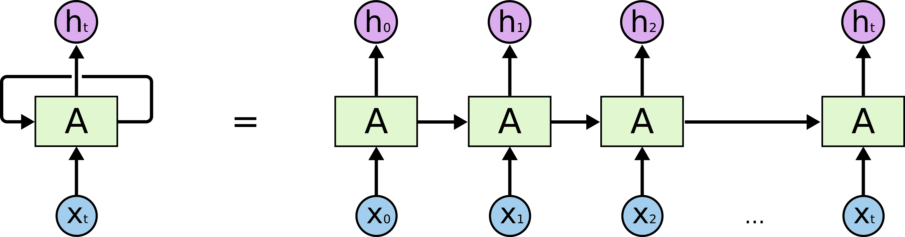

https://colab.research.google.com/drive/1ysEKrw_LE2jMndo1snrZUh5w87LQsCxk#forceEdit=true&sandboxMode=true&scrollTo=O8_jPL_Kkr-a

__**DAY 15**__

NLP is a discipline in computing that deals with the communication between natural (human) languages and computer languages.
Eg:- Spellcheck or Autocomplete.
NLP is the field that focuses on how computers can understand and/or process natural/human languages

Much more capable of processing sequential data such as text or characters called a recurrent neural network (RNN)

Sequence Data
Unlike images, sequence data such as long chains of text, weather patterns, videos and really anything where the notion of a step or time is relevant needs to be processed and handled in a special way.

Encoding Text
As we know machine learning models and neural networks don't take raw text data as an input. This means we must somehow encode our textual data to numeric values that our models can understand. There are many different ways of doing this and we will look at a few examples below.
Before we get into the different encoding/preprocessing methods let's understand the information we can get from textual data by looking at the following two movie reviews.

"I thought the movie was going to be bad, but it was actually amazing!"

"I thought the movie was going to be amazing, but it was actually bad!"

Although these two setences are very similar we know that they have very different meanings. This is because of the ordering of words, a very important property of textual data.
Now keep that in mind while we consider some different ways of encoding our textual data.

1. Bag of Words
The first and simplest way to encode our data is to use something called bag of words. This is a pretty easy technique where each word in a sentence is encoded with an integer and thrown into a collection that does not maintain the order of the words but does keep track of the frequency. Have a look at the python function below that encodes a string of text into bag of words.

2. Integer Encoding
This involves representing each word or character in a sentence as a unique integer and maintaining the order of these words. This should hopefully fix the problem we saw before were we lost the order of words.

3. Word Embeddings
This method keeps the order of words intact as well as encodes similar words with very similar labels. It attempts to not only encode the frequency and order of words but the meaning of those words in the sentence. It encodes each word as a dense vector that represents its context in the sentence.
Unlike the previous techniques word embeddings are learned by looking at many different training examples. You can add what's called an embedding layer to the beggining of your model and while your model trains your embedding layer will learn the correct embeddings for words. You can also use pretrained embedding layers.
a vectorized representation of words in a given document that places words with similar meanings near each other.

Recurrent Neural Networks (RNN's)

Now that we've learned a little bit about how we can encode text it's time to dive into recurrent neural networks. Up until this point we have been using something called **feed-forward** neural networks. This simply means that all our data is fed forwards (all at once) from left to right through the network. This was fine for the problems we considered before but won't work very well for processing text. After all, even we (humans) don't process text all at once. We read word by word from left to right and keep track of the current meaning of the sentence so we can understand the meaning of the next word. Well this is exaclty what a recurrent neural network is designed to do. When we say recurrent neural network all we really mean is a network that contains a loop. A RNN will process one word at a time while maintaining an internal memory of what it's already seen. This will allow it to treat words differently based on their order in a sentence and to slowly build an understanding of the entire input, one word at a time.

This is why we are treating our text data as a sequence! So that we can pass one word at a time to the RNN.

Let's have a look at what a recurrent layer might look like.

Let's define what all these variables stand for before we get into the explination.

**ht** output at time t
**xt** input at time t
**A** Recurrent Layer (loop)
What this diagram is trying to illustrate is that a recurrent layer processes words or input one at a time in a combination with the output from the previous iteration. So, as we progress further in the input sequence, we build a more complex understanding of the text as a whole.
What we've just looked at is called a **simple RNN layer**. It can be effective at processing shorter sequences of text for simple problems but has many downfalls associated with it. One of them being the fact that as text sequences get longer it gets increasingly difficult for the network to understand the text properly.

LSTM
The layer we dicussed in depth above was called a *simpleRNN*. However, there does exist some other recurrent layers (layers that contain a loop) that work much better than a simple RNN layer. The one we will talk about here is called LSTM (Long Short-Term Memory). This layer works very similarily to the simpleRNN layer but adds a way to access inputs from any timestep in the past. Whereas in our simple RNN layer input from previous timestamps gradually disappeared as we got further through the input. With a LSTM we have a long-term memory data structure storing all the previously seen inputs as well as when we saw them. This allows for us to access any previous value we want at any point in time. This adds to the complexity of our network and allows it to discover more useful relationships between inputs and when they appear. 

Sentiment Analysis
And now time to see a recurrent neural network in action. For this example, we are going to do something called sentiment analysis.
The formal definition of this term from Wikipedia is as follows:
*the process of computationally identifying and categorizing opinions expressed in a piece of text, especially in order to determine whether the writer's attitude towards a particular topic, product, etc. is positive, negative, or neutral.*
The example we’ll use here is classifying movie reviews as either postive, negative or neutral.
*This guide is based on the following tensorflow tutorial: https://www.tensorflow.org/tutorials/text/text_classification_rnn*

